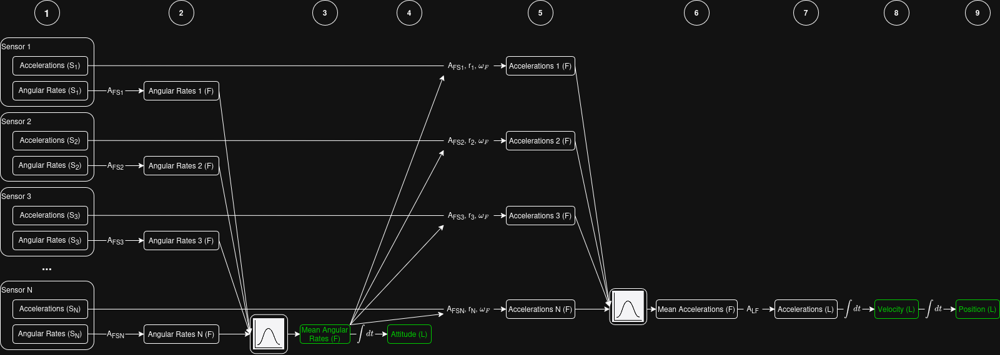

# Fused Inertial Measurement Unit aRray (FIMUR)
Can the performance of high-cost IMUs be matched through the fusion of a large array of MEMS IMUs?

## Coordinate Frames
### Sensor (S)
The S frame is the frame in which the sensor outputs measurements.

### Filter (F)
The F frame is the frame in which the output of the filter is represented. The origin and orientation of each IMU must be initialized in this frame. 
    Origin: position of the S origin of the IMU as (x_F, y_F, z_F)
    Rotation: Direction cosine matrix from IMU S frame to F frame

### Wake (W)
The W frame is an inertial frame colocated with the F frame at filter startup (wake). It does not move with the sensor, and is the frame in which position estimates are represented.

### ENU (L)
The ENU frame is an inertial frame with origin colocated with the Filter frame origin.

## Filters

### 1: Intuitive Filter
Naive filter that implements my intuition about how a filter should work

*Figure 1: Flow diagram of Intuitive Filter*

### Dependencies

## Python
Running with python 3.12.3
Ensure the following libraries are installed using `pip install <library>`
- serial
- pyserial
- pandas
- numpy
- pyqtgraph
- pyside6
- allantools
- PyQt5

### PyQt
- `sudo apt update`
- `sudo apt install libxcb-cursor0`

## References
1 [Interactive Kalman Filter Tutorial](https://arthurlovekin.com/interactive-kalman-filter/index.html)

2 [Extended Kalman Filter](https://mwrona.com/posts/attitude-ekf/)

3 Sarabandi, S; Thomas, F - Accurate Computation of Quaternions from Rotation Matrices

4 [Rotation Quaternions, and How to Use Them](https://danceswithcode.net/engineeringnotes/quaternions/quaternions.html)

5 [AHRS Complimenatary Filter](https://ahrs.readthedocs.io/en/latest/filters/complementary.html)

6 [Building a Virtual Gyro](https://www.nxp.com/company/about-nxp/smarter-world-blog/BL-BUILDING-VIRTUAL-GYRO)

7 [Gauss Markov Theorem](https://www.statlect.com/fundamentals-of-statistics/Gauss-Markov-theorem)

8 [Sensor Fusion for Distributed Inertial Measurement Units](https://hollydinkel.github.io/assets/pdf/AAS2025.pdf)

9 [Understanding ARW: The Hidden Limit to IMU Accuracy (Part 1)](https://guidenav.com/blog/understanding-arw-the-hidden-limit-to-imu-accuracy-part-1/)